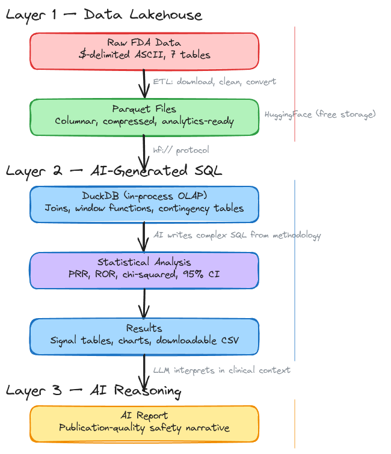

# Complex Data Analysis with Agentic AI: A Case Study in Pharmacovigilance with FDA's FAERS data

*How a Data Lakehouse architecture and an AI coding agent turned months of specialized work into a free, live tool for drug safety research.*

**By Alex Punnen**

---

## Summary

Complex data analysis that once required expert programmers, data analysts, and domain specialists working together over weeks can now be done with AI in a weekend. That much is obvious — AI has become remarkably capable. But raw capability isn't enough. What makes it practical is a repeatable pattern:

1. **Data Lakehouse** — structure raw data into columnar formats (Parquet) for fast analytical queries
2. **AI-generated SQL** — let an AI agent write the complex OLAP queries that would normally require a database specialist
3. **AI reasoning layer** — use an LLM to interpret the statistical results in domain context

To test this pattern, I built something that reportedly costs organizations $50K-500K/year using commercial platforms, or months of specialized research labor: a pharmacovigilance signal detection tool using FDA's FAERS adverse event data. The tool is free, live, and produces the same statistical analysis found in published drug safety studies.

The FAERS signal detection tool is live at [alexcpn-faers-signal-detection.hf.space](https://alexcpn-faers-signal-detection.hf.space/). I am not expert to test it though; I hope this really helps some-one

---

## The Case-Study 

When a doctor suspects a drug is causing an unexpected side effect, the evidence trail leads to the FDA's FAERS database — 2.9 million voluntary adverse event reports. The data is public. The analysis methodology is well-established: disproportionality statistics (PRR, ROR, chi-squared) that compare a drug's adverse event rate against the background.

But getting from raw data to answer has always been the problem.

Published FAERS studies require biostatisticians, SAS licenses ($5K-15K/year), weeks of data cleaning, and months of peer review. The output: one paper, about one drug class, frozen in time behind a paywall. Commercial pharmacovigilance platforms (Oracle Argus, IQVIA) run $50K-500K/year and still require trained operators.

The FDA's own [public dashboard](https://fis.fda.gov/sense/app/95239e26-e0be-42d9-a960-9a5f7f1c25ee/sheet/8eef7d83-7945-4091-b349-e5c41ed49f99/state/analysis) shows raw report counts — but not the disproportionality statistics that pharmacovigilance actually requires. "Drug X has 47 depression reports" tells you nothing without context. Is 47 high relative to how often the drug is reported overall? That question needs statistics the dashboard doesn't compute.

The data is free. The methodology is published. The barrier has always been engineering — the data pipelines, the statistical computation, the interface to make it usable.

That barrier is now gone.

---

## The Recipe: Three Layers

The three-layer pattern from the summary isn't abstract — here is exactly how each layer works, using the FAERS tool as a concrete example.

### Layer 1: Data Lakehouse — Making Raw Data Queryable

The foundation is an architectural pattern I wrote about three years ago: [From Data Warehouse to Data Lake to Data Lakehouse](https://medium.com/@alexpunnen/from-data-warehouse-to-data-lake-to-data-lakehouse-7f6c8c1b5e3a). The idea is straightforward — store analytical data in columnar formats like Apache Parquet, query it with SQL engines, and you get warehouse-grade analytical power without warehouse-grade cost or complexity.

The FDA publishes FAERS as messy, dollar-sign-delimited ASCII files — seven tables (demographics, drugs, reactions, outcomes, indications, therapies, report sources), millions of rows, riddled with duplicates and inconsistent coding. Raw, this data is nearly unusable for statistical analysis.

Convert it to Parquet and the picture changes entirely. An OLAP engine like DuckDB can tear through millions of rows in seconds — joins across all seven tables, aggregations, window functions for case deduplication. No database server to manage. No infrastructure cost. Just files and a query engine.

This is the Lakehouse pattern applied: take raw, unwieldy data, structure it into an analytics-ready columnar format, let a SQL engine do what SQL engines do best. The entire stack runs for free — Parquet on HuggingFace, DuckDB in-process, Streamlit on HuggingFace Spaces.

### Layer 2: AI-Generated SQL — Writing the Complex Queries

The SQL behind disproportionality analysis is genuinely complex. Multi-table joins across seven FAERS tables. Window functions to deduplicate cases (keeping only the latest version of each case report). CASE expressions to normalize age fields reported variously in years, months, decades, and days. Carefully constructed 2x2 contingency tables for every drug-adverse event pair:

|  | Event present | Event absent |
|--|--------------|-------------|
| **Drug reported** | a | b |
| **Drug not reported** | c | d |

From this: PRR = (a/(a+b)) / (c/(c+d)). ROR = (a*d)/(b*c). Chi-squared for significance. 95% confidence intervals via log-normal approximation. Evans' criteria for signal flagging (PRR ≥ 2, chi² ≥ 4, n ≥ 3).

Writing this SQL by hand requires both database expertise and pharmacovigilance domain knowledge. That combination is rare and expensive. But an AI coding agent (Claude Code, in this case) can generate it from a description of the methodology — and debug the inevitable edge cases along the way (CTE optimization quirks, reserved keyword collisions, division-by-zero guards in sparse contingency tables).

### Layer 3: AI Reasoning — Interpreting the Numbers

The statistical output — tables of PRR values, confidence intervals, p-values — is precise but opaque to non-specialists. The third layer uses an LLM to interpret these results in clinical context. When a user clicks "Generate AI Report," the computed statistics are sent to Claude or GPT-4 (using the user's own API key), which produces a structured narrative:

- Why a signal for Drug X + adverse event Y is consistent (or inconsistent) with the drug's known mechanism of action
- Whether a signal is likely a confounder — antidepressants will always show a "depression" signal because they are prescribed *to depressed patients* (indication bias)
- How the findings compare to what is already on the drug label
- What the limitations of voluntary reporting mean for this specific result

This layer transforms data into judgment. Not a replacement for expert review, but a first draft that would take a specialist hours to write.

**Together: Parquet makes the data queryable. AI makes the queries writable. AI makes the results interpretable.** The engineering bottleneck between "we have data and a known methodology" and "we have usable answers" collapses.

---

## The Tool

This is now a live, free web application at **[alexcpn-faers-signal-detection.hf.space](https://alexcpn-faers-signal-detection.hf.space/)**.

A user types a drug name and gets:

- **Signal detection** for every adverse event associated with that drug: PRR, ROR, chi-squared, 95% confidence intervals, Evans' criteria flagging
- **Drug class comparison**: side-by-side analysis across multiple drugs (e.g., all VMAT2 inhibitors for tardive dyskinesia)
- **Demographics**: age and sex distribution of reporters
- **Outcome severity**: breakdown by death, hospitalization, disability, life-threatening events
- **Visualizations**: signal bar charts (red = signal, gray = non-signal), volcano plots, forest plots with confidence intervals
- **Downloadable CSV** for further analysis or publication
- **AI-generated safety narrative** (optional, bring your own API key): the LLM receives the computed statistics and produces a structured report — contextualizing signals against known pharmacology, flagging confounders like indication bias (antidepressants will always show a "depression" signal because they are prescribed *to depressed patients*), and noting limitations of voluntary reporting

### Validation

To verify correctness, the benchmark is a 2023 published study: Yokoi et al. (*Expert Opinion on Drug Safety*) analyzed VMAT2 inhibitors and found that tetrabenazine shows a disproportionate depression signal while valbenazine does not.

The tool reproduces this finding. Tetrabenazine: depression PRR > 2, meeting Evans' criteria. Valbenazine: depression PRR < 1, no signal. Same methodology, same result — available to anyone, instantly, for free.

---

## Who This Could Possibly For

This is not a replacement for rigorous pharmacovigilance. FAERS is voluntary reporting — signals are not causation. Report counts do not reflect true incidence rates. Stimulated reporting and the Weber effect skew newer drugs. These limitations are displayed prominently in the tool.

But it hopefully democratizes the first step: the screening scan that tells you where to look, or give others to extend and make this really usefull.

- **A clinician** noticing an unusual symptom pattern in a patient on a new medication can check the signal in 30 seconds
- **A researcher** at a university with no pharmacovigilance department can screen an entire drug class before deciding whether a full study is worth pursuing
- **A patient advocacy group** investigating a suspected side effect can see the same statistics that would otherwise require a commercial platform or a funded research team
- **A small pharma company** without a dedicated pharmacovigilance team can run safety screening during drug development

The people who most need drug safety data have always been the ones least able to access the analysis. That shouldn't be the case when the data is public and the methods are known.

---

## The Bigger Picture: Domain Experts as Builders

The pharmacovigilance tool is a case study, not an endpoint. The pattern generalizes:

**Any domain where public data exists and established analytical methods are known is a candidate for the same approach.**

| Domain | Public Data | Established Methods | Potential Tool |
|--------|------------|-------------------|----------------|
| Pharmacovigilance | FDA FAERS, EudraVigilance | PRR, ROR, EBGM | Drug safety signal detection |
| Epidemiology | CDC WONDER, WHO GHO | Standardized rates, joinpoint regression | Disease burden dashboards |
| Clinical Research | ClinicalTrials.gov | Meta-analysis, survival analysis | Evidence synthesis tools |
| Public Health | Syndromic surveillance | CUSUM, Poisson regression | Outbreak detection |
| Health Economics | Claims databases | Cost-effectiveness analysis | Resource utilization dashboards |

The same three layers apply each time:

1. **Data Lakehouse** — convert raw formats to Parquet, host on free object storage, query with an OLAP engine
2. **AI-generated SQL** — describe the analytical methodology to an AI agent, let it write and debug the complex queries
3. **AI reasoning** — let an LLM interpret the statistical output in domain context

The domain expert's role is what it always should have been: provide the right question, the right methodology, and the judgment to validate results. The engineering — data pipelines, SQL, web interfaces, deployment — is what the AI handles.

The expensive, slow part was never the statistics. It was the engineering between the question and the answer. That barrier is collapsing.

---

*The FAERS signal detection tool is live at [alexcpn-faers-signal-detection.hf.space](https://alexcpn-faers-signal-detection.hf.space/). Source code, data pipeline, and a guide for domain experts building similar tools: [github.com/alexcpn/ai_lakehouse](https://github.com/alexcpn/ai_lakehouse). Background on the Data Lakehouse architecture: [From Data Warehouse to Data Lake to Data Lakehouse](https://medium.com/@alexpunnen/from-data-warehouse-to-data-lake-to-data-lakehouse-7f6c8c1b5e3a).*
